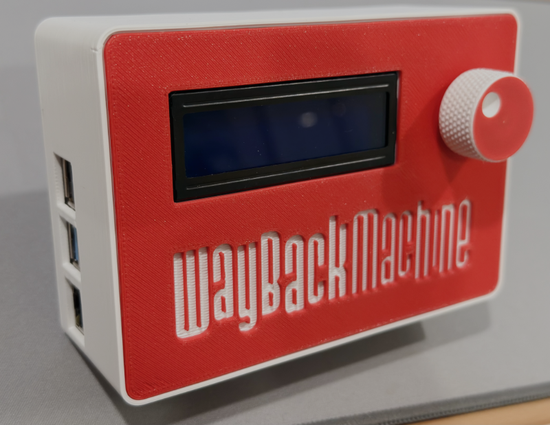
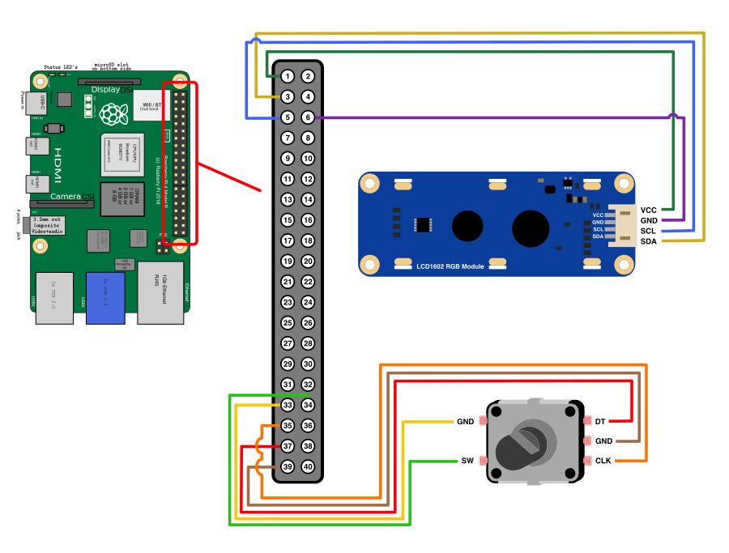

# WaybackProxy

<p align="center">
  
</p>

WaybackProxy is a complete end-to-end solution for browsing archived web content on vintage computers. It transforms a Raspberry Pi into a dedicated time-traveling proxy server that retrieves pages from the [Internet Archive Wayback Machine](http://web.archive.org) or [OoCities](http://www.oocities.org) and delivers them in their original form—without toolbars, scripts, or other extraneous content that may confuse retro browsers.

## What Makes This Different

Unlike basic proxy scripts, WaybackProxy is a **fully-integrated hardware and software solution** that's ready to deploy:

- **Optimized for Raspberry Pi**: Designed and tested specifically for Raspberry Pi 4 running fresh installations of Raspberry Pi OS (Debian Trixie). One-command installation handles everything automatically.

- **Dual Proxy Modes**:
  - **Transparent Gateway Mode**: Connect any vintage computer directly to the Pi's Ethernet port—no browser configuration needed. All HTTP traffic is automatically routed through the Wayback Machine.
  - **Standard Proxy Mode**: Access the proxy remotely from any device on your WiFi network (port 8888). Perfect for multiple vintage computers or modern devices.

- **Physical Hardware Interface**: Optional LCD display and rotary encoder let you navigate through time without touching a keyboard. Turn the dial to change dates, see the current settings at a glance—ideal for demonstrations and retro computing setups.

- **Production-Ready**: Includes systemd service integration, automatic startup on boot, comprehensive logging, web-based configuration interface, and robust error handling. This isn't a hobby script—it's a complete appliance.

Whether you're connecting a single vintage Mac via Ethernet or serving an entire vintage computer lab over WiFi, WaybackProxy provides a turnkey solution for exploring web history on period-appropriate hardware.

*Built upon the original proxy concept by richardg867 at https://github.com/richardg867/WaybackProxy*

## What You'll Need

### Hardware Requirements

**Raspberry Pi System:**
- Raspberry Pi 4 Model B (2GB RAM minimum, 4GB recommended)
- MicroSD card (16GB minimum) with fresh Raspberry Pi OS Lite 64-bit installation (Debian Trixie)
- WiFi connection configured during OS installation using [Raspberry Pi Imager](https://www.raspberrypi.com/software/)

**Display and Input:**
- [Waveshare LCD1602 RGB Module](https://www.waveshare.com/lcd1602-rgb-module.htm) - I2C interface LCD display with RGB backlight
- [KY-040 Rotary Encoder](https://www.amazon.ca/dp/B08728K3YB) or similar - 360° rotation with integrated push button

**Wiring:**
All components connect to the Raspberry Pi GPIO header. See the wiring diagram below:



**3D Printable Case:**
STL files for a custom Raspberry Pi enclosure are included in the `assets/` directory. The case accommodates the Raspberry Pi 4, LCD display, and rotary encoder.

**GPIO Pin Connections (BCM numbering):**
- GPIO 26 → Rotary Encoder CLK
- GPIO 19 → Rotary Encoder DT
- GPIO 13 → Rotary Encoder SW (push button)
- I2C SDA/SCL → LCD Display (auto-detected on I2C bus)
- 5V and GND → Power for both components

### Software Prerequisites

- Raspberry Pi OS Lite 64-bit (Debian 13 Trixie or newer)
- WiFi Internet connection on the Raspberry Pi

## Installation

### Step 1: Prepare Your Raspberry Pi

Connect to your Raspberry Pi via SSH using the default **pi** user.

**Update the system:**
```bash
sudo apt update && sudo apt upgrade -y && sudo apt autoremove -y && sudo apt autoclean
```

**Enable I2C interface:**
```bash
sudo raspi-config
```
Navigate to: **Interface Options** → **I2C** → Select **Yes** → **OK** → **Finish**

**Reboot to apply changes:**
```bash
sudo reboot
```

### Step 2: Run the Automated Installer

After the Pi reboots, reconnect via SSH and run:

```bash
sudo bash -c "$(curl https://raw.githubusercontent.com/izzy-gm/waybackproxy/refs/heads/main/scripts/install.sh)"
```

This installs the **latest stable release** by default. To install a specific version or branch:

```bash
# Install from main branch (latest development code)
WAYBACKPROXY_BRANCH=main sudo bash -c "$(curl https://raw.githubusercontent.com/izzy-gm/waybackproxy/refs/heads/main/scripts/install.sh)"

# Install specific release
WAYBACKPROXY_BRANCH=v2.0.0 sudo bash -c "$(curl https://raw.githubusercontent.com/izzy-gm/waybackproxy/refs/heads/main/scripts/install.sh)"
```

**The installer will:**
- Install all system dependencies (Python 3, I2C tools, GPIO libraries)
- Create a dedicated `waybackproxy` system user
- Install WaybackProxy to `/opt/waybackproxy`
- Configure the hardware interface (LCD + rotary encoder)
- Set up a systemd service to run automatically on boot
- Create default configuration files

**During installation:**
- When prompted about **iptables-persistent**, select **Yes** to save both IPv4 and IPv6 rules
- If asked about **gateway mode**, type **Y** to enable transparent proxy via Ethernet port (allows devices connected via Ethernet to automatically use the proxy without configuration)

### Step 3: Final Reboot

```bash
sudo reboot
```

After the Pi reboots, WaybackProxy will start automatically. The LCD display will show the current date and status.

### Managing the Service

**Check service status:**
```bash
systemctl status waybackproxy
```

**Restart the service:**
```bash
sudo systemctl restart waybackproxy
```

**View live logs:**
```bash
journalctl -u waybackproxy -f
```

**Edit configuration:**
```bash
sudo nano /opt/waybackproxy/config.json
sudo systemctl restart waybackproxy
```

### Updating WaybackProxy

To update to the latest stable release, re-run the installation script:

```bash
sudo bash -c "$(curl https://raw.githubusercontent.com/izzy-gm/waybackproxy/refs/heads/main/scripts/install.sh)"
```

Your `config.json` and `whitelist.txt` files will be automatically preserved.

**Note:** The installer always pulls from the latest release by default. To update to bleeding-edge development code, use `WAYBACKPROXY_BRANCH=main`.

## Usage

### Using the Hardware Interface

The rotary encoder and LCD display provide an intuitive interface for navigating through dates:

- **Rotate** the encoder to change the selected value (year, month, or day)
- **Press** the button to cycle between year → month → day → year
- The LCD displays the current date and selection mode

The date changes take effect immediately—no restart required.

### Connecting Retro Computers

**Option 1: Gateway Mode (Transparent Proxy)**
If you enabled gateway mode during installation, simply:
1. Connect your vintage computer to the Raspberry Pi's Ethernet port
2. Configure the client to use DHCP
3. Browse to any HTTP website—it automatically shows archived content

No browser configuration required.

**Option 2: Standard Proxy Mode**
Configure your browser to use WaybackProxy as an HTTP proxy:

- **Proxy Auto-Configuration (PAC)**: `http://<raspberry-pi-ip>:8888/proxy.pac`
- **Manual HTTP Proxy**: Host: `<raspberry-pi-ip>`, Port: `8888` (default)

Replace `<raspberry-pi-ip>` with your Raspberry Pi's IP address.

### Command-Line Options

When running WaybackProxy manually:

| Option | Description |
|--------|-------------|
| `--config FILE` | Specify configuration file path (default: `config.json`) |
| `--headless` | Run without hardware UI (proxy only mode) |
| `--debug` | Enable debug logging |

## Configuration

WaybackProxy is configured via `/opt/waybackproxy/config.json`:

### Proxy Settings

| Parameter | Default | Description |
|-----------|---------|-------------|
| `LISTEN_PORT` | `8888` | HTTP proxy listen port (1024-65535) |
| `DATE` | `20011025` | Target date for archived content (formats: `YYYYMMDD`, `YYYYMM`, or `YYYY`) |
| `DATE_TOLERANCE` | `365` | Allow content up to X days after the target date (`null` = unlimited) |
| `GEOCITIES_FIX` | `true` | Redirect GeoCities URLs to oocities.org |
| `QUICK_IMAGES` | `true` | Use direct Wayback URLs for images/assets (faster loading) |
| `WAYBACK_API` | `false` | Use Availability API to find closest snapshots (slower but more accurate) |
| `CONTENT_TYPE_ENCODING` | `true` | Include charset in Content-Type header (disable for very old browsers like Mosaic) |
| `SILENT` | `false` | Disable console logging |
| `SETTINGS_PAGE` | `true` | Enable web-based configuration at `http://web.archive.org` |

### Hardware Settings (Optional)

These settings configure the hardware interface when running with LCD display and rotary encoder:

| Parameter | Default | Description |
|-----------|---------|-------------|
| `HARDWARE.display_type` | `lcd` | Display type: `lcd` (LCD1602 RGB Module) or `terminal` (console output) |
| `HARDWARE.input_method` | `rotary` | Input method: `rotary` (rotary encoder) or `keyboard` (arrow keys) |
| `HARDWARE.gpio_clk` | `26` | GPIO pin for rotary encoder CLK signal (BCM numbering, 0-27) |
| `HARDWARE.gpio_dt` | `19` | GPIO pin for rotary encoder DT signal (BCM numbering, 0-27) |
| `HARDWARE.gpio_button` | `13` | GPIO pin for push button switch (BCM numbering, 0-27) |

**Note:** Hardware settings are only used when running with hardware UI (without `--headless` flag). In headless mode, these settings are ignored.

### Web-Based Configuration

When connected through the proxy, browse to `http://web.archive.org` to access the settings interface (if `SETTINGS_PAGE` is enabled). You can adjust configuration options in real-time.

**Note:** Changes made via the web interface are temporary. For permanent changes, edit `/opt/waybackproxy/config.json` and restart the service.

### Domain Whitelist

Add domains to `/opt/waybackproxy/whitelist.txt` (one per line) to bypass the Wayback Machine. Useful for:
- Local network services (routers, NAS devices)
- Modern websites that should load directly
- APIs or services that don't need archiving

**Example:**
```
localhost
192.168.1.1
api.example.com
```

After editing the whitelist, restart the service:
```bash
sudo systemctl restart waybackproxy
```

## Gateway Mode (Transparent Proxy)

Gateway mode transforms your Raspberry Pi into a transparent proxy. Devices connected via Ethernet automatically route all HTTP traffic through WaybackProxy—no browser configuration needed.

### Enabling Gateway Mode

If you didn't enable gateway mode during installation, run:

```bash
sudo /opt/waybackproxy/scripts/setup-gateway.sh
```

**This configures:**
- Static IP `10.88.88.1` on the Ethernet port
- DHCP server for automatic IP assignment to clients
- NAT and IP forwarding
- Automatic HTTP traffic redirection (port 80) to WaybackProxy

### Network Configuration

| Setting | Value |
|---------|-------|
| Gateway IP | `10.88.88.1` |
| Client IP Range | `10.88.88.100` - `10.88.88.200` |
| DNS Server | `10.88.88.1` (forwards to `8.8.8.8`) |

### Connecting Clients

1. Connect your vintage computer to the Raspberry Pi's Ethernet port
2. Configure the client to use DHCP, or manually set:
   - IP: Any address in `10.88.88.2` - `10.88.88.254` range
   - Gateway: `10.88.88.1`
   - DNS: `10.88.88.1`
3. Browse to any HTTP website—archived content appears automatically

### Disabling Gateway Mode

```bash
sudo /opt/waybackproxy/scripts/disable-gateway.sh
```

**Limitations:**
- Only HTTP (port 80) is transparently proxied
- HTTPS traffic bypasses the proxy (this is expected)
- Ideal for vintage computers without HTTPS support

## Troubleshooting

### Service Issues

**Service won't start:**
```bash
sudo systemctl status waybackproxy
journalctl -u waybackproxy -n 50
```

**Restart the service:**
```bash
sudo systemctl restart waybackproxy
```

### Hardware Issues

**LCD display not working:**
```bash
# Verify I2C is enabled
ls /dev/i2c-*

# Scan for I2C devices (should show 0x3E and 0x60)
i2cdetect -y 1

# If devices aren't detected, enable I2C and reboot
sudo raspi-config  # Interface Options → I2C → Yes
sudo reboot
```

**Rotary encoder not responding:**
- Verify GPIO connections match the wiring diagram
- Check that GPIO pins 26, 19, and 13 are not used by other services
- Ensure the encoder is powered (connected to 5V and GND)

### Viewing Logs

**Live system logs:**
```bash
journalctl -u waybackproxy -f
```

**Application logs:**
```bash
tail -f /var/log/waybackproxy/waybackproxy.log
tail -f /var/log/waybackproxy/waybackproxy.error.log
```

## Known Limitations

### Wayback Machine Reliability
The Internet Archive Wayback Machine has occasional issues:
- Pages newer than the target date may appear (use specific `YYYYMMDD` dates for better accuracy)
- Random broken images or assets
- 404 errors from archival-time issues (incorrect capitalization, bad server responses)
- Redirect loops on certain sites
- Temporary server errors

### WaybackProxy Limitations
- **HTTP only**: POST and CONNECT methods are not supported (this is not a full-featured proxy)
- **Transparent mode compatibility**: Requires HTTP/1.1, incompatible with very old pre-1996 browsers (use standard proxy mode instead)
- **Redirect handling**: Some redirect scripts are worked around, but destination URLs may not be archived

## Acknowledgments

### Contributors

**Izzy Graniel** - Project maintainer and primary developer
- Complete architectural refactoring and modernization to modular Python structure
- Hardware interface implementation (LCD display, rotary encoder, GPIO integration)
- Raspberry Pi platform integration and automated installation system
- Gateway mode and transparent proxy functionality
- Configuration system improvements and documentation

**richardg867** - [Original WaybackProxy](https://github.com/richardg867/WaybackProxy)
- Original proxy concept and core HTTP proxy implementation
- Wayback Machine integration and URL rewriting logic
- OoCities redirect functionality
- Initial configuration system

**Claude Code** - AI-assisted development
- Code refactoring and architecture design
- Documentation improvements and technical writing
- Testing and debugging assistance

### Third-Party Code

This project includes code from the following sources:

- **Waveshare LCD1602 RGB Module** - LCD display driver code
  - Source: https://files.waveshare.com/upload/5/5b/LCD1602-RGB-Module-demo.zip
  - Location: `/src/waybackproxy/hardware/lcd.py`
  - Used under their distribution terms

### Special Thanks

- [Internet Archive](https://archive.org/) - For maintaining the Wayback Machine and making web history accessible to everyone

## Additional Resources

- [INSTALL.md](INSTALL.md) - Detailed installation documentation
- [CLAUDE.md](CLAUDE.md) - Development guidelines and architecture details
- [Original WaybackProxy](https://github.com/richardg867/WaybackProxy) by richardg867
- [Donate to Internet Archive](https://archive.org/donate/) - Support the Wayback Machine

## License

This project is licensed under the GNU General Public License v3.0 - see the [LICENSE](LICENSE) file for details.

Copyright (C) 2024-2026 Izzy Graniel
Copyright (C) 2023 richardg867 (original WaybackProxy)
